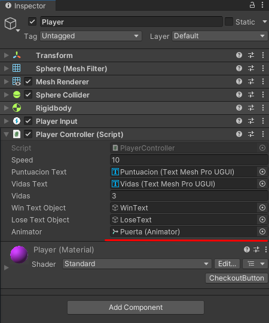

# Roll a ball

## Descripción

Este proyecto hecho con Unity consiste en un pequeño minijuego en el que el jugador, representado por una bola morada, tendrá que conseguir todas las monedas sin perder todas las vidas, evitando enemigos que perseguirán al jugador.

## Vista previa


## Novedades en el proyecto

### Obstáculos

Se han añadido dos objetos 3D en nuestro terreno de juego que serviran como obstáculos que dificultarán completar el objetivo.


Hablaremos más en profundida sobre el papel que juegan más adelante.

---


### Compuerta

Podremos presionar la tecla 'E' y la tecla 'Q' para activar una animación de abrir o cerrar la compuerta en uno de los lados del terreno.


Para ello hacemos uso del siguiente código:

```csharp
void Update() 
     {
          if (animator != null)
          {
               if (Input.GetKey(KeyCode.E))
               {
                    animator.SetTrigger("TrOpen");
                    Debug.Log("E PRESIONADO");
               }
               if (Input.GetKey(KeyCode.Q))
               {
                    animator.SetTrigger("TrClose");
                    Debug.Log("Q PRESIONADO");
               }
          }
          
     }
```
Localizamos este código en el método Update para que pueda ejecutarse en cualquier instancia de nuestro juego siempre que este esté ejecutandose.

Siempre y cuando haya un animator (se lo otorgamos nosotros desde el menú 'Inspector').

<details>
<summary>Inspector</summary>
<br>



<br>

</details>

Y siempre y cuando el input que le llegue sea una tecla 'E', cambiará el Trigger "TrOpen" a activo lo cuál hará que se ejecute nuesta animación de apertura.


La animación para cerrar será la misma que para abrir solo que a la inversa. Para ello pondremos su velocidad a -1.

<details>
<summary>Animación 'Cerrada'</summary>
<br>


<br>

</details>

---

### Sistema de vidas

Con este sistema de vidas añadimos la posibilidad de que algo impida cumplir el objetivo ya que si llega a 0 se dará por perdido el juego.

Se nos mostrará una ventana de "Game Over" y se __saldrá forzosamente del juego__.


Para ello hacemos uso del siguiente método al que se llama al ejecutar por primera vez el script en el método `Start()` y cada vez que recogemos un coleccionable en el método `onTriggerEnter()`

```csharp
void SetVidasText()
     {
          vidasText.text = "Vidas: " + vidas.ToString();

          if (vidas == 0)
          {
               loseTextObject.SetActive(true);

               Application.Quit(); // Cierra el codigo (una vez construido el proyecto)
               UnityEditor.EditorApplication.isPlaying = false; // Cierra el modo Jugar en el Unity Editor
          }
     }
```

Cada vez que se llama de primeras se resetea el texto de 'vidasText' con el valor de 'String' de `vidas` (variable local privada que guarda el numero de vidas en un integer).

Si el número de vidas es igual a 0 entonces hace visible el `loseTextObject` el cual es un texto que dice "GAME OVER" en color rojo.

<details>
<summary>Game Over</summary>
<br>


<br>

</details>

Además de eso llama al método de Unity `Quit()` y cambia `UnityEditor.EditorApplication.isPlaying` a "False". 

El cual hace que el programa se deje de ejecutar. 

---


## Enemigos

Se han añadido una serie de enemigos que perseguirán al jugador incansablemente.


Los enemigos son bolas de color rojo que hacen una animación palpitante

Los enemigos constituyen un peligro para la completación del juego ya que en contacto con el jugador restarán una vida este. El enemigo en concreto que colisione con el jugador desaparecerá del juego.

Haremos usaro de una "NavMesh" para su movimiento la cual es un área en la que pueden moverse las entidades.

Para evitar que el PathFinding de los enemigos les haga tratar de ir __a través__ de nuestros objetos debemos tenerlos en cuenta al hacer el "NavMesh" añadiendolos como "Not Walkable" para que el "NavMesh" se genere evitandolos.


Vista del NavMesh de nuestro proyecto


Para iniciar los enemigos haremos uso de un "GameObject" que llamaremos "Spawner" cuyo propósito será generar instancias de cuantos enemigos que queramos.

Haremos uso de un script para manejar el comportamiento de este "Spawner".


#### Variables

_Spawner.cs_
```csharp
public Enemy enemy;
private List<Enemy> enemies;    
[Range (0,100)]
public int numberOfEnemies = 25;
private float range = 70.0f;
```

__Enemy__: declara una variable pública llamada "enemy" que representa el prefabricado (Prefab) del enemigo. Significa que puedes arrastrar y soltar el Prefab del enemigo desde la carpeta de "Assets" de Unity al campo "enemy" en el menú Inspector.

__enemies__: declara una lista privada llamada "enemies" que contendrá todas las instancias de enemigos generadas por el "Spawner".

__numberOfEnemies__: declara una variable pública llamada "numberOfEnemies" que determina cuántos enemigos se generarán. El atributo [Range (0,100)] limita este valor a un rango entre 0 y 100. Esto se puede modificar desde el menú Inspector.

#### numberofenemies inspector.png

__range__: declara una variable privada que especifica el rango dentro de que se generarán los enemigos.


#### Método Start

Start es método especial de Unity que se ejecuta una vez al inicio del juego.

_Spawner.cs_
```c#
void Start()
{
    enemies = new List<Enemy>(); // init as type
    for (int index = 0; index < numberOfEnemies; index++)
    {
        Enemy spawned = Instantiate(enemy, NavMeshLocation(range), Quaternion.identity) as Enemy;
        enemies.Add(spawned);
    }
}
```

__enemies = new List<Enemy>()__: inicializa la lista de enemigos.

El bucle for itera desde 0 hasta el número de enemigos especificado (numberOfEnemies), instancia un enemigo utilizando "Instantiate", y lo agrega a la lista de enemigos.

#### Método NavMeshLocation

"NavMeshLocation" es un método que genera una posición aleatoria dentro de un radio específico (radius) utilizando la funcionalidad del "NavMesh" (una herramienta de Unity para la navegación de agentes). Esta función intenta encontrar una posición válida dentro del "NavMesh" para colocar al enemigo.

_Spawner.cs_
```csharp
public Vector3 NavMeshLocation(float radius)
{
    Vector3 randomDirection = Random.insideUnitSphere * radius;
    randomDirection += transform.position;
    NavMeshHit hit;
    Vector3 finalPosition = Vector3.zero;
    if (NavMesh.SamplePosition(randomDirection, out hit, radius, 1))
    {
        finalPosition = hit.position;
    }
    return finalPosition;
}
```

Dentro de "NavMeshLocation", se genera una dirección aleatoria dentro de un radio esférico con Random.insideUnitSphere * radius. Luego, se ajusta esta dirección sumándole la posición del Spawner. Después, utiliza "NavMesh.SamplePosition" para intentar encontrar una posición válida para inicializar el objeto dentro del "NavMesh" en esa dirección. Si encuentra una posición válida, la devuelve, sino, devuelve "Vector3.zero".

## Animator Controller

A estos cambios le sumamos el uso del Animator Controller para manejar animaciones en nuestros personajes.

Los enemigos harán una animación cíclica en la que se expanden y contraen a modo de respiración.


Enemigo haciendo la animación de respiración.

---
✒️ por [SamuelDam1](https://github.com/samueldam1) 
